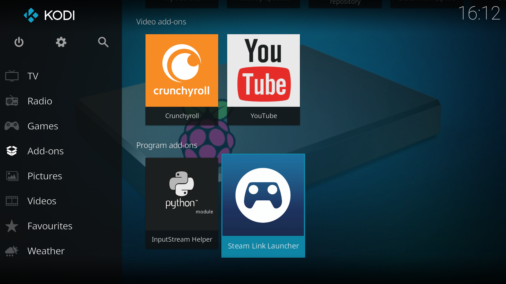

# Steam Link Launcher

This Addon launches SteamLink from the Kodi Programs Page.

It is exclusive to **Raspbian** OS. Tested in **Raspberry Pi 3B**



## Features

- Useful for TV Setups with Kodi controlled via [**CEC**](https://en.wikipedia.org/wiki/Consumer_Electronics_Control) (using TV remote to control Kodi). With this the user doesn't need to exit Kodi and launch SteamLink from Desktop, which requires mouse or keyboard.
- Standard Plug and Play for gamepads. Just plug in your controller and Steam Link will recognize it. No additional setup is required
- After exiting SteamLink, your Kodi session is resumed.

## Getting Started

### Prerequisites

- **Raspberry PI** and **RaspbianOS** that supports Steamlink. Check this [link](https://support.steampowered.com/kb_article.php?ref=6153-IFGH-6589) for more information
- Have `kodi` installed

```bash
sudo apt update
sudo apt install kodi
```

- Have `steamlink` installed

```bash
sudo apt update
sudo apt install steamlink
```

### Installation

- Download the addon via terminal in your rpi or via ssh connection:

```bash
wget -L https://github.com/excelsi0r/game.steamlink.launcher/archive/master.zip -O /home/pi/Downloads/game.steamlink.launcher.zip
```

- In **Kodi** go to `Addons -> Install from zip file` and the file **game.steamlink.launcher.zip** located in the Downloads folder.

## Tips and Tricks

- **Make Kodi start automatically on boot** [link](https://www.raspberrypi.org/forums/viewtopic.php?t=132637)
  - `sudo nano /etc/rc.local`
  - Add the line `su - pi -c kodi` before `exit 0`
  - Save the file
- **Add Shutdown and Reboot functions to kodi** [link](https://yingtongli.me/blog/2016/12/23/kodi-power.html)
  - `sudo nano /etc/polkit-1/localauthority/50-local.d/all_users_shutdown_reboot.pkla`
  - Copy and paster the following contents into the file you are editing

    ```ini
    [Allow all users to shutdown and reboot]
    Identity=unix-user:*
    Action=org.freedesktop.login1.*;org.freedesktop.upower.*;org.freedesktop.consolekit.system.*
    ResultActive=yes
    ResultAny=yes
    ResultInactive=yes
    ```

  - Save and exit the file
  - Reboot
  
- **Configure XBOX One Wireless Controller for Raspbian**
  - Follow the [link](https://github.com/atar-axis/xpadneo)

## Issues

- **SteamLink doesn't start**
  - Check Startup kodi behavior
    - Make sure there is no `kodi.desktop` file in `~/.config/autostart` directory.
    - Make sure there are no other `*.desktop` files in `~/.config/autostart` that initializes kodi on startup
    - If you want to start kodi automatically follow the [link](#tips-and-tricks) above.
  - Steamlink auto-updates itself. During the update process it might need manual input for additional confirmation
    - Execute `steamlink` from a terminal or ssh connection to update it manually
    - Reboot
